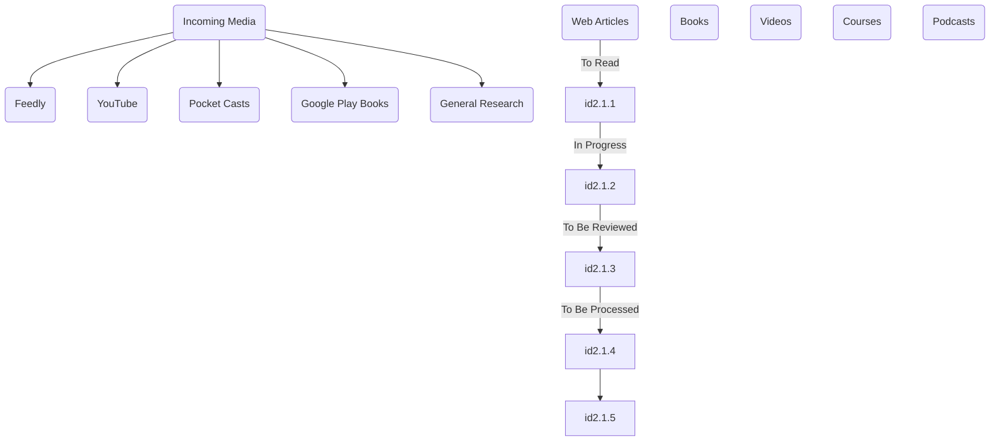

# Mermaid Overview

```mermaid
graph TD
id1(Incoming Media)
id1.1(Feedly)
id1.2(YouTube)
id1.3(Pocket Casts)
id1.4(Google Play Books)
id1.5(General Research)
id2.1(Web Articles)
id2.2(Books)
id2.3(Videos)
id2.4(Courses)
id2.5(Podcasts)
id1 --> id1.1 & id1.2 & id1.3 & id1.4 & id1.5
id2.1 -- To Read --> id2.1.1
id2.1.1 -- In Progress --> id2.1.2
id2.1.2 -- To Be Reviewed --> id2.1.3
id2.1.3 -- To Be Processed --> id2.1.4
id2.1.4 --> id2.1.5
```

## Referências
- https://mermaid-js.github.io/mermaid/#/
- https://www.mishacreatrix.com/knowledge-management-flow-diagram-in-obsidian